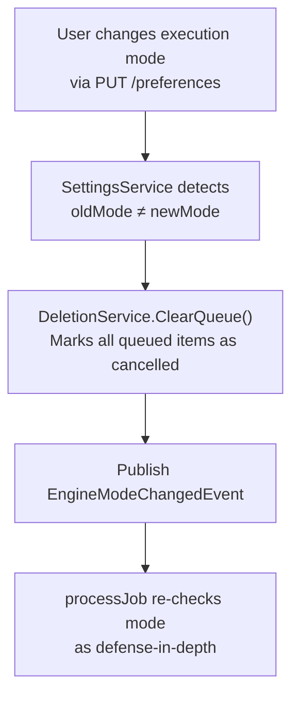

# Deletion Queue Mode-Change Safety

**Status:** ✅ Complete  
**Created:** 2026-03-24  
**Severity:** Critical — can cause unintended data deletion  
**Branch:** `fix/deletion-queue-mode-change`

## Problem

When the execution mode is changed while items are sitting in the deletion queue (during the grace period or mid-processing), the queued items execute under the **new** mode's semantics instead of being cancelled or continuing under the **original** mode.

### Root Cause

The `DeletionService.processJob()` method has a **split-brain** dry-run determination:

- `DeleteJob.ForceDryRun` is captured at **enqueue time** (poller decides based on mode at poll time)
- `DeletionsEnabled` is read at **processing time** (fresh from DB via `SettingsService.GetPreferences()`)

When the poller enqueues jobs in **auto mode**, the `DeleteJob` has `ForceDryRun=false` and a live `Client`. If the user then switches to **approval** or **dry-run** mode while those items are in the grace period, `processJob()` still executes them as real deletions because `ForceDryRun` was baked in at enqueue time and nothing clears the queue on mode change.

The `EngineModeChangedEvent` is published by `SettingsService.UpdatePreferences()` but **no subscriber clears the deletion queue** in response.

### Dangerous Transitions

| From | To | Risk | Explanation |
|------|----|------|-------------|
| auto | approval | 🔴 Critical | Queued auto items still delete instead of requiring approval |
| auto | dry-run | 🔴 Critical | Queued auto items still delete instead of dry-running |
| dry-run | auto | ⚠️ Low | `ForceDryRun=true` persists on job, so current batch is safe. Next poller cycle re-enqueues correctly. |
| dry-run | approval | ⚠️ Low | Same — `ForceDryRun=true` persists. Queue should still be cleared for cleanliness. |
| approval | auto | ✅ Safe | Approval items live in DB, not the deletion queue |
| approval | dry-run | ✅ Safe | Same — no items in deletion queue |

### Reproduction Steps

1. Set execution mode to **auto** with `DeletionsEnabled=true`
2. Configure a disk group above threshold so the poller queues items
3. While items are in the grace period (default 30s), change mode to **approval**
4. Observe: items are deleted instead of being cancelled or moved to approval queue

## Solution: Clear Queue on Mode Change + Defense-in-Depth

### Architecture



### Implementation Steps

#### Step 1: Add `DeletionQueueClearer` interface to `SettingsService`

**File:** `internal/services/settings.go`

Add a narrow interface dependency to `SettingsService` so it can clear the deletion queue without importing `DeletionService` directly:

```go
// DeletionQueueClearer allows SettingsService to clear the deletion queue
// when execution mode changes, without importing DeletionService directly.
type DeletionQueueClearer interface {
    ClearQueue() int
}
```

Add a field to `SettingsService`:

```go
type SettingsService struct {
    db               *gorm.DB
    bus              *events.EventBus
    deletionClearer  DeletionQueueClearer // injected after construction
}
```

Add a setter method (same pattern as `DeletionService.SetDependencies()`):

```go
func (s *SettingsService) SetDeletionClearer(clearer DeletionQueueClearer) {
    s.deletionClearer = clearer
}
```

#### Step 2: Clear queue in `UpdatePreferences()` on mode change

**File:** `internal/services/settings.go`

In the existing mode-change detection block, add queue clearing **before** publishing the event:

```go
if oldPrefs.ExecutionMode != payload.ExecutionMode {
    // Clear the deletion queue to prevent stale jobs from executing
    // under the wrong mode. ClearQueue() uses the cancellation skip-list,
    // so items already mid-processing get the "cancelled" treatment.
    if s.deletionClearer != nil {
        cleared := s.deletionClearer.ClearQueue()
        if cleared > 0 {
            slog.Info("Cleared deletion queue on execution mode change",
                "component", "services",
                "oldMode", oldPrefs.ExecutionMode,
                "newMode", payload.ExecutionMode,
                "cleared", cleared)
        }
    }

    s.bus.Publish(events.EngineModeChangedEvent{
        OldMode: oldPrefs.ExecutionMode,
        NewMode: payload.ExecutionMode,
    })
}
```

#### Step 3: Clear queue on `DeletionsEnabled` toggle (true → false)

**File:** `internal/services/settings.go`

The same class of bug applies when a user disables deletions while auto-mode items are in the grace period. Add a check:

```go
if oldPrefs.DeletionsEnabled && !payload.DeletionsEnabled {
    if s.deletionClearer != nil {
        cleared := s.deletionClearer.ClearQueue()
        if cleared > 0 {
            slog.Info("Cleared deletion queue on deletions disabled",
                "component", "services", "cleared", cleared)
        }
    }
}
```

#### Step 4: Add `EnqueuedMode` field to `DeleteJob` for defense-in-depth

**File:** `internal/services/deletion.go`

Add a field to `DeleteJob` that records the execution mode at enqueue time:

```go
type DeleteJob struct {
    // ... existing fields ...
    EnqueuedMode string // Execution mode when this job was enqueued (defense-in-depth)
}
```

#### Step 5: Re-check mode in `processJob()` as defense-in-depth

**File:** `internal/services/deletion.go`

At the top of `processJob()`, after the cancellation check, add a mode-change guard:

```go
// Defense-in-depth: if the execution mode changed since this job was enqueued,
// treat it as cancelled. This catches items that were dequeued between the
// ClearQueue() call and the mode change, or race conditions where the worker
// dequeues an item just before ClearQueue() marks it.
if job.EnqueuedMode != "" {
    if prefs, err := s.settings.GetPreferences(); err == nil {
        if prefs.ExecutionMode != job.EnqueuedMode {
            s.processed.Add(1)
            s.batchSucceeded.Add(1)

            logEntry := db.AuditLogEntry{
                MediaName:   job.Item.Title,
                MediaType:   string(job.Item.Type),
                Action:      db.ActionCancelled,
                SizeBytes:   job.Item.SizeBytes,
                Trigger:     job.Trigger,
                DiskGroupID: job.DiskGroupID,
            }
            if err := s.auditLog.Create(logEntry); err != nil {
                slog.Error("Failed to create audit log entry", "component", "services", "error", err)
            }

            s.bus.Publish(events.DeletionCancelledEvent{
                MediaName: job.Item.Title,
                MediaType: string(job.Item.Type),
                SizeBytes: job.Item.SizeBytes,
            })
            s.publishProgress()

            slog.Info("Deletion cancelled — execution mode changed since enqueue",
                "component", "services",
                "media", job.Item.Title,
                "enqueuedMode", job.EnqueuedMode,
                "currentMode", prefs.ExecutionMode)
            return
        }
    }
}
```

Also add a comment above the existing `DeletionsEnabled` re-read to document why it's intentional:

```go
// Re-read DeletionsEnabled at processing time (not enqueue time) as a safety net.
// If the user disabled deletions while items were in the grace period, this
// catches it and forces dry-run. This is intentional — see
// docs/plans/20260324T1740Z-deletion-queue-mode-change-safety.md.
deletionsEnabled := false
if prefs, err := s.settings.GetPreferences(); err == nil {
    deletionsEnabled = prefs.DeletionsEnabled
}
```

#### Step 6: Early-exit in `drainAll()` on mode change

**File:** `internal/services/deletion.go`

The `drainAll()` method processes items sequentially with a 3-second rate limiter between each. For a batch of 50 items, that's ~2.5 minutes. If the user changes mode 10 seconds into the drain, the `processJob()` defense-in-depth (Step 5) catches each item individually, but the worker still wastes time on the rate limiter wait for items that will just be cancelled.

Add an early-exit check in the drain loop, after dequeuing each job but before the rate limiter wait:

```go
drainLoop:
for {
    job, ok := s.dequeueJob()
    if !ok {
        break
    }

    // Check for stop signal between jobs
    select {
    case <-s.stopCh:
        s.processJob(job, &deferredAuditEntries)
        break drainLoop
    default:
    }

    // Early-exit: if execution mode changed since this job was enqueued,
    // cancel all remaining items immediately instead of processing them
    // one-by-one through the rate limiter. This avoids wasting ~3s per
    // item on jobs that processJob() would cancel anyway.
    if job.EnqueuedMode != "" {
        if prefs, err := s.settings.GetPreferences(); err == nil {
            if prefs.ExecutionMode != job.EnqueuedMode {
                // Process this one job (processJob will cancel it),
                // then cancel all remaining jobs in bulk
                s.processJob(job, &deferredAuditEntries)
                s.cancelRemainingOnModeChange(job.EnqueuedMode, &deferredAuditEntries)
                break drainLoop
            }
        }
    }

    _ = s.rateLimiter.Wait(context.Background())
    s.processJob(job, &deferredAuditEntries)
}
```

Add a helper method `cancelRemainingOnModeChange()` that drains the queue and marks each item as cancelled without rate limiting:

```go
// cancelRemainingOnModeChange drains remaining queued items and marks them
// as cancelled due to an execution mode change. Called by drainAll() when
// it detects the mode changed mid-drain, to avoid wasting time on the
// rate limiter for items that would all be cancelled by processJob() anyway.
func (s *DeletionService) cancelRemainingOnModeChange(enqueuedMode string, deferredAuditEntries *[]db.AuditLogEntry) {
    for {
        job, ok := s.dequeueJob()
        if !ok {
            break
        }
        // processJob() will detect the mode mismatch and cancel the item
        s.processJob(job, deferredAuditEntries)
    }
    slog.Info("Cancelled remaining queued items due to mode change",
        "component", "services", "enqueuedMode", enqueuedMode)
}
```

#### Step 7: Enhance nil-client guard with `EnqueuedMode` logging

**File:** `internal/services/deletion.go`

The existing nil-client guard at the actual-deletion path (line ~509) silently fails when `job.Client == nil`. This can only happen if a dry-run job somehow bypasses the `ForceDryRun` check — exactly the class of bug we're fixing. Enhance the error log to include `EnqueuedMode` for forensic debugging:

```go
if job.Client == nil {
    slog.Error("Deletion job has nil client — cannot perform actual deletion",
        "component", "services",
        "media", job.Item.Title,
        "enqueuedMode", job.EnqueuedMode,
        "forceDryRun", job.ForceDryRun)
    s.failed.Add(1)
    s.batchFailed.Add(1)
    s.publishProgress()
    return
}
```

#### Step 8: Set `EnqueuedMode` at all enqueue sites

**File:** `internal/poller/evaluate.go`

In the auto-mode branch (line ~287):

```go
if err := p.reg.Deletion.QueueDeletion(services.DeleteJob{
    // ... existing fields ...
    EnqueuedMode: db.ModeAuto,
}); err != nil {
```

In the dry-run branch (line ~337):

```go
if err := p.reg.Deletion.QueueDeletion(services.DeleteJob{
    // ... existing fields ...
    EnqueuedMode: db.ModeDryRun,
}); err != nil {
```

**File:** `internal/services/approval.go`

In `ExecuteApproval()` (line ~511):

```go
if queueErr := deps.Deletion.QueueDeletion(DeleteJob{
    // ... existing fields ...
    EnqueuedMode: prefs.ExecutionMode, // capture current mode
}); queueErr != nil {
```

In `ManualDelete()` (line ~639):

```go
if queueErr := deps.Deletion.QueueDeletion(DeleteJob{
    // ... existing fields ...
    EnqueuedMode: mode,
}); queueErr != nil {
```

#### Step 9: Wire up the dependency in `registry.go`

**File:** `internal/services/registry.go`

After the existing `SetDependencies()` calls, add:

```go
reg.Settings.SetDeletionClearer(reg.Deletion)
```

#### Step 10: Audit action constant (deviation)

**Planned:** Add `ActionCancelledModeChange = "cancelled_mode_change"` constant.

**Actual:** Used existing `ActionCancelled` instead. The SQLite baseline migration has a CHECK constraint on the `action` column (`action IN ('deleted','dry_delete','cancelled')`) that would reject the new value. Adding a new migration to alter the constraint was unnecessary complexity — the structured log message (`"Deletion cancelled — execution mode changed since enqueue"`) already distinguishes mode-change cancellations from user cancellations for forensic purposes.

#### Step 11: Write unit tests

**File:** `internal/services/deletion_test.go`

Add tests for:

- `TestProcessJob_ModeChangeCancelsJob` — enqueue a job with `EnqueuedMode=auto`, change prefs to `approval`, verify job is cancelled
- `TestDrainAll_EarlyExitOnModeChange` — enqueue multiple jobs, change mode mid-drain, verify remaining items are cancelled without rate limiter delay
- `TestClearQueueOnModeChange` — verify `SettingsService.UpdatePreferences()` calls `ClearQueue()` when mode changes
- `TestClearQueueOnDeletionsDisabled` — verify queue is cleared when `DeletionsEnabled` goes from true to false
- `TestNoQueueClearOnSameModeUpdate` — verify queue is NOT cleared when mode stays the same
- `TestNilClientGuardLogsEnqueuedMode` — verify the nil-client error log includes `EnqueuedMode` field

**File:** `internal/services/settings_test.go`

Add tests for:

- `TestUpdatePreferences_ModeChange_ClearsQueue` — mock `DeletionQueueClearer`, verify `ClearQueue()` is called
- `TestUpdatePreferences_DeletionsDisabled_ClearsQueue` — same for `DeletionsEnabled` toggle
- `TestUpdatePreferences_NoModeChange_NoQueueClear` — verify no call when mode unchanged

#### Step 12: Run `make ci` and verify

Run the full CI pipeline locally to ensure all tests pass and no linting issues.

## Files Modified

| File | Change |
|------|--------|
| `internal/services/settings.go` | Add `DeletionQueueClearer` interface, `SetDeletionClearer()`, queue clearing in `UpdatePreferences()` |
| `internal/services/deletion.go` | Add `EnqueuedMode` field to `DeleteJob`, mode-change guard in `processJob()`, early-exit in `drainAll()`, `cancelRemainingOnModeChange()` helper, enhanced nil-client guard logging, `DeletionsEnabled` re-read comment |
| `internal/services/registry.go` | Wire `Settings.SetDeletionClearer(Deletion)` |
| `internal/poller/evaluate.go` | Set `EnqueuedMode` on all `QueueDeletion()` calls |
| `internal/services/approval.go` | Set `EnqueuedMode` on `QueueDeletion()` calls in `ExecuteApproval()` and `ManualDelete()` |
| `internal/services/deletion_test.go` | New tests for mode-change cancellation, early-exit, nil-client guard |
| `internal/services/settings_test.go` | New tests for queue clearing on mode change |

## Risk Assessment

- **Low risk:** The `ClearQueue()` method already exists and is well-tested. It uses the cancellation skip-list pattern, so items mid-processing are handled gracefully.
- **No data loss:** Clearing the queue only cancels pending items — it doesn't delete any media. The next poller cycle will re-evaluate under the new mode.
- **Backward compatible:** The `EnqueuedMode` field defaults to empty string, and the defense-in-depth check skips validation when empty, so existing jobs (e.g., from a rolling upgrade) are unaffected.
