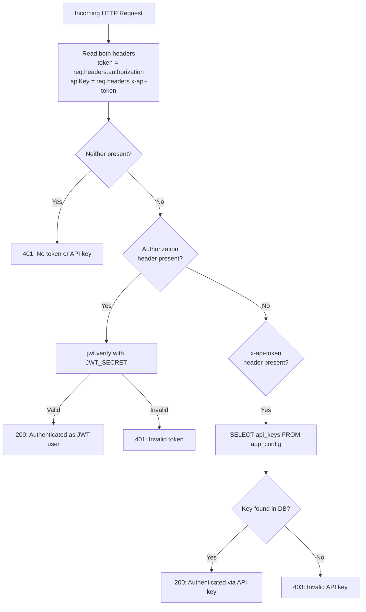

# Fix Jellystat Authentication — Use `x-api-token` Header

> **Status:** ✅ Complete
> **Created:** 2026-03-24
> **Branch:** `fix/jellystat-auth` (from `main`)
> **Closes:** #5
> **Reported by:** @tomislavf

## Problem

Jellystat authentication fails with the error:

> "jellystat auth failed (JWT token may be expired — regenerate in Jellystat Settings)"

The root cause: Capacitarr's [`JellystatClient.doRequest()`](../backend/internal/integrations/jellystat.go:32) sends the user's API key as an `Authorization: Bearer <token>` header (line 34). However, Jellystat's [`authenticate` middleware](https://github.com/CyferShepard/Jellystat/blob/main/backend/server.js#L189-L229) supports **two** distinct auth mechanisms:

1. **JWT Bearer token** via `Authorization` header — used internally by Jellystat's own web UI after user login. These are short-lived JWTs signed with `JWT_SECRET`.
2. **API Key** via `x-api-token` header or `apiKey` query parameter — used by external integrations. API keys are stored in Jellystat's database and do not expire.

When Capacitarr sends a Jellystat API key in the `Authorization: Bearer` header, Jellystat takes the JWT code path (line 199: `if (token)`), attempts `jwt.verify()` on the API key string, which fails because it's not a valid JWT — resulting in a 401 "Invalid token" response.

### Jellystat Auth Flow Diagram



**Critical insight:** Jellystat checks `Authorization` first (`if (token)` on line 199). When Capacitarr sends the API key as `Authorization: Bearer <key>`, Jellystat enters the JWT branch and never reaches the API key branch — the API key is verified as a JWT and rejected.

## Solution

Change [`JellystatClient.doRequest()`](../backend/internal/integrations/jellystat.go:32) to use the `x-api-token` header instead of `Authorization: Bearer`. This is the correct header for external API access, matches how Jellystat documents its API key authentication, and uses a non-expiring credential.

### Why `x-api-token` instead of `Authorization: Bearer`

| Aspect | `Authorization: Bearer` | `x-api-token` |
|--------|------------------------|----------------|
| Intended for | Jellystat web UI sessions | External API clients |
| Token type | JWT signed with `JWT_SECRET` | Static API key from DB |
| Expiration | JWT-defined expiry | Never expires |
| Server code path | `jwt.verify()` on line 206 | DB lookup on line 215 |
| What users have | API key from Settings page | API key from Settings page |

Users generate API keys in Jellystat's Settings page. These are static database tokens — **not** JWTs. Sending them via `x-api-token` routes to the correct server-side validation path.

## Implementation Steps

### Step 1: Update `JellystatClient.doRequest()` to use `x-api-token` header

**File:** [`jellystat.go`](../backend/internal/integrations/jellystat.go:32)

Change line 34 from:
```go
return DoAPIRequest(fullURL, "Authorization", "Bearer "+j.Token)
```
to:
```go
return DoAPIRequest(fullURL, "x-api-token", j.Token)
```

### Step 2: Update struct documentation and field naming

**File:** [`jellystat.go`](../backend/internal/integrations/jellystat.go:11)

- Update the `JellystatClient` doc comment (lines 11-17) to reference API key auth via `x-api-token` instead of JWT Bearer
- Rename the `Token` field to `APIKey` for consistency with other clients like [`TautulliClient`](../backend/internal/integrations/tautulli.go:15) which uses `APIKey string`
- Update the json struct tag comment to reference `IntegrationConfig.APIKey` rather than JWT

The struct should look like:
```go
// JellystatClient provides access to the Jellystat API for enriched Jellyfin
// watch history. Jellystat is to Jellyfin what Tautulli is to Plex — a
// supplementary analytics service that provides per-user watch history, play
// counts, and activity tracking beyond what Jellyfin's native API exposes.
//
// Authentication uses Jellystat's API key mechanism. The key is stored in the
// standard APIKey field and sent as the `x-api-token` header.
type JellystatClient struct {
    URL    string
    APIKey string `json:"-"` // Jellystat API key (stored in IntegrationConfig.APIKey)
}
```

### Step 3: Update `NewJellystatClient()` constructor

**File:** [`jellystat.go`](../backend/internal/integrations/jellystat.go:24)

Rename the parameter from `token` to `apiKey` and the field assignment from `Token` to `APIKey`:
```go
func NewJellystatClient(url, apiKey string) *JellystatClient {
    return &JellystatClient{
        URL:    strings.TrimRight(url, "/"),
        APIKey: apiKey,
    }
}
```

### Step 4: Update `doRequest()` to reference the renamed field

**File:** [`jellystat.go`](../backend/internal/integrations/jellystat.go:32)

```go
func (j *JellystatClient) doRequest(endpoint string) ([]byte, error) {
    fullURL := j.URL + endpoint
    return DoAPIRequest(fullURL, "x-api-token", j.APIKey)
}
```

### Step 5: Update `TestConnection()` error message

**File:** [`jellystat.go`](../backend/internal/integrations/jellystat.go:39)

Change the 401 error message from referencing JWT tokens to referencing API keys:
```go
if strings.Contains(err.Error(), "unauthorized") {
    return fmt.Errorf("jellystat auth failed (check your API key — generate one in Jellystat Settings → API Keys)")
}
```

### Step 6: Update all test assertions

**File:** [`jellystat_test.go`](../backend/internal/integrations/jellystat_test.go)

- [`TestJellystatClient_TestConnection_Success`](../backend/internal/integrations/jellystat_test.go:15): Change header assertion from `Authorization: Bearer` to `x-api-token`
- [`TestJellystatClient_TestConnection_Unauthorized`](../backend/internal/integrations/jellystat_test.go:36): Update expected error string from "JWT token may be expired" to match new message
- [`TestJellystatClient_BearerAuthHeader`](../backend/internal/integrations/jellystat_test.go:231): Rename test to `TestJellystatClient_APIKeyHeader` and assert `x-api-token` header instead of `Authorization: Bearer`
- Rename `testJellystatToken` constant to `testJellystatAPIKey` for clarity

### Step 7: Run `make ci` to verify

Run the full CI suite to confirm all tests pass, lint is clean, and no regressions are introduced.

## Files Changed

| File | Change |
|------|--------|
| [`jellystat.go`](../backend/internal/integrations/jellystat.go) | Fix auth header, rename field, update error message |
| [`jellystat_test.go`](../backend/internal/integrations/jellystat_test.go) | Update test assertions for new auth pattern |

## Files NOT Changed

| File | Reason |
|------|--------|
| [`factory.go`](../backend/internal/integrations/factory.go) | `NewJellystatClient(url, apiKey)` signature unchanged |
| [`enrichers.go`](../backend/internal/integrations/enrichers.go) | JellystatEnricher unaffected — auth is in client layer |
| [`httpclient.go`](../backend/internal/integrations/httpclient.go) | Generic `DoAPIRequest()` already supports any header k/v |
| [`types.go`](../backend/internal/integrations/types.go) | Integration type constants unchanged |
| [`integrationHelpers.ts`](../frontend/app/utils/integrationHelpers.ts) | UI label already shows "API Key" for Jellystat |
| [`SettingsIntegrations.vue`](../frontend/app/components/settings/SettingsIntegrations.vue) | Form already collects `apiKey` — no UI change needed |
| DB migrations | No schema change — `APIKey` column already exists and is reused |

## Risk Assessment

**Risk: Low** — This is a one-line functional fix (header name change) with supporting documentation and test updates. No database changes, no API contract changes, no UI changes.

- **Breaking change?** No. Users re-enter the same API key from Jellystat Settings. The key value is the same; only the HTTP header it's transmitted in changes.
- **Backward compatibility?** N/A — the current code is completely broken for all Jellystat users. Any existing Jellystat integration config will work after this fix without reconfiguration.
- **Upstream stability?** The `x-api-token` header has been in Jellystat since API keys were added. The `authenticate` middleware checks both `Authorization` and `x-api-token` in a stable order (JWT first, API key second).
