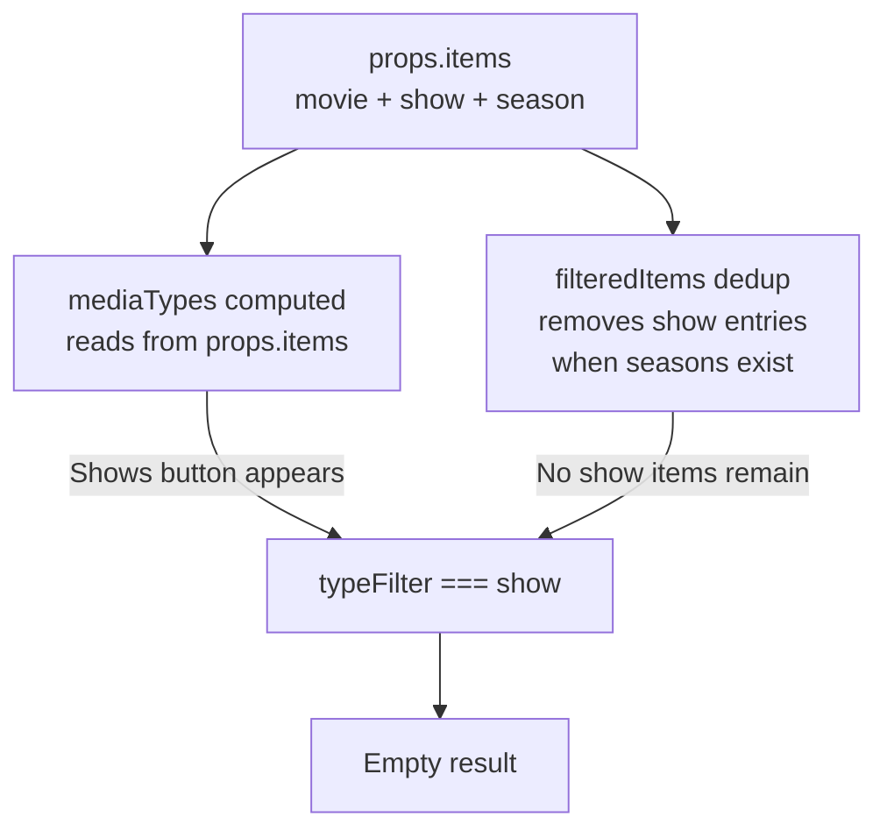

# Issue #9: Library Management — Shows Filter Doesn't Work

**Status:** ✅ Complete (Phase 2 — full grouped approach)
**Issue:** [starshadow/software/capacitarr#9](https://gitlab.com/starshadow/software/capacitarr/-/work_items/9)
**Reporter:** @tomislavf
**Branch:** `fix/shows-filter`

## Problem

In Library Management, three media-type filter buttons appear: **Movies**, **Seasons**, and **Shows**. Clicking **Shows** displays an empty list.

### Root Cause

The filter buttons are generated from the **raw** `props.items` data (which includes `show`-type entries from the backend). However, the `filteredItems` computed property has dedup logic that **removes** all `show`-type entries when corresponding seasons exist — because seasons provide granular per-season management. After dedup, no items with `type === 'show'` remain, so the filter matches nothing.



### Key Code Locations

| File | Lines | Purpose |
|------|-------|---------|
| `frontend/app/components/LibraryTable.vue` | 45-48 | `mediaTypes` computed — derives filter buttons from raw items |
| `frontend/app/components/LibraryTable.vue` | 84-133 | `filteredItems` computed — dedup + search + type/integration filter + sort |
| `frontend/app/components/LibraryTable.vue` | 390-398 | Filter button rendering in template |
| `frontend/app/types/api.ts` | 209-236 | `MediaItem` interface — `showTitle`, `seasonNumber`, `type` fields |
| `backend/internal/integrations/types.go` | 136-195 | Backend `MediaItem` struct — `ShowTitle`, `Type` fields |

### Available Data

Season items from the backend carry:
- `type: "season"`
- `showTitle: string` — the parent TV show name
- `seasonNumber: number` — season number
- `episodeCount: number` — number of episodes
- `posterUrl: string` — poster image

This provides a natural grouping key (`showTitle`) without any backend changes.

---

## Solution: Two-Phase Approach

Try the simple approach first; if the UX isn't satisfactory, implement the full grouped approach.

### Phase 1: Simple Approach — Sort-Grouped Flat List

When the "Shows" filter is active, display all season-type items sorted primarily by `showTitle` so seasons of the same show cluster together visually.

#### Changes

**Step 1.1: Extract dedup into `dedupedItems` computed**

Refactor `filteredItems` in `LibraryTable.vue` to split the dedup logic into a separate `dedupedItems` computed property. Both `mediaTypes` and `filteredItems` will derive from `dedupedItems`.

**Step 1.2: Fix `mediaTypes` to derive from `dedupedItems`**

Change the `mediaTypes` computed to read from `dedupedItems` instead of `props.items`. This ensures only types present after dedup appear as filter buttons. After dedup, `show` type items are removed, so "show" would no longer appear... but we WANT it. So instead, we keep deriving from `props.items` but add special handling: the "show" button should be synthetic — always present when season items exist.

Actually, the cleanest approach: keep `mediaTypes` derived from `props.items`, but when `typeFilter === 'show'`, change the filter logic to match `type === 'season'` instead. This way:
- The "Shows" button still appears (derived from raw items that include show-type)
- Clicking it shows all season items (which is the TV show content)
- Sort by `showTitle` first so same-show seasons group together

**Step 1.3: Change filter behavior for `typeFilter === 'show'`**

In the `filteredItems` computed, modify the type filter logic:

```typescript
// Before:
if (typeFilter.value) {
  result = result.filter((e) => e.item.type === typeFilter.value);
}

// After:
if (typeFilter.value) {
  if (typeFilter.value === 'show') {
    // Shows filter: display all seasons grouped by parent show
    result = result.filter((e) => e.item.type === 'season');
  } else {
    result = result.filter((e) => e.item.type === typeFilter.value);
  }
}
```

**Step 1.4: Auto-sort by `showTitle` when Shows filter is active**

When `typeFilter === 'show'`, apply a secondary sort that groups by `showTitle` first, then by the user's chosen sort within each group. This makes seasons of the same show appear together.

**Step 1.5: Display `showTitle` as subtitle in table/grid view**

In the table view, when a season item has a `showTitle`, display it as a subtle subtitle below the title. In grid view, the `MediaPosterCard` may already show this. Verify and adjust if needed.

**Step 1.6: Update badge count for Shows filter button**

The Shows filter button should show a count of unique show titles (not individual seasons). Update the badge count logic.

Wait — the badge counts are in `library.vue` for the smart filter presets (dead, stale, requested, protected), not for the media type buttons. The media type buttons in `LibraryTable.vue` (lines 390-398) don't have badge counts. No change needed here.

**Step 1.7: Run `make ci` and visual review**

---

### Phase 2: Full Grouped Approach — Visual Group Headers (if Phase 1 UX is insufficient)

If the flat-list clustering from Phase 1 doesn't provide enough visual clarity, implement proper group header rows.

#### Changes

**Step 2.1: Create `ShowGroupHeader` type**

Define a discriminated union or wrapper type that represents either a group header or a data row:

```typescript
type LibraryRow =
  | { kind: 'header'; showTitle: string; seasonCount: number; totalBytes: number }
  | { kind: 'item'; entry: EvaluatedItem };
```

**Step 2.2: Build grouped row list**

When `typeFilter === 'show'`, build a flat array of `LibraryRow` items where group headers are interspersed:

```
[header: "Firefly", item: S1, item: S2, header: "Breaking Bad", item: S1, ...]
```

**Step 2.3: Adapt table virtualizer**

The `tableVirtualizer` uses a fixed `estimateSize` of 41px. With mixed row types, we need variable sizing: headers might be ~32px, data rows ~41px. Use the virtualizer's `estimateSize` callback with index to return the appropriate height.

**Step 2.4: Render group headers in table view**

Add conditional rendering in the table body: if the virtual row is a header, render a `<UiTableRow>` spanning all columns with the show title and aggregate stats. If it's an item, render the normal row.

**Step 2.5: Adapt grid virtualizer**

Similar to the table virtualizer but for the grid view. Headers would span the full width as a single-column row.

**Step 2.6: Selection mode handling**

Group headers must not be selectable. The `toggleItem`, `selectAll`, `deselectAll` functions need to skip header rows.

**Step 2.7: Collapsible groups (optional enhancement)**

Add expand/collapse state per show group. Initially all expanded. Clicking a header collapses/expands its children. This affects the row count for the virtualizer.

**Step 2.8: Run `make ci` and visual review**

---

## Acceptance Criteria

- [ ] Clicking the "Shows" filter button displays all TV show content (seasons grouped by show)
- [ ] The display is visually clear — users can easily see which seasons belong to which show
- [ ] "Seasons" filter continues to work as before (flat list of individual seasons)
- [ ] "Movies" filter continues to work as before
- [ ] Selection mode works correctly with the Shows view
- [ ] Both table view and grid view work with the Shows filter
- [ ] `make ci` passes
- [ ] No regressions in other filters (dead, stale, requested, protected)

## Commit Message

```
fix(library): make Shows filter display seasons grouped by show

When clicking the Shows filter button in Library Management, the list
was empty because show-level entries are deduped when seasons exist.
The Shows filter now displays all season entries sorted by their parent
show title, providing a show-centric view of TV content.

Reported-by: @tomislavf
Closes #9
```
