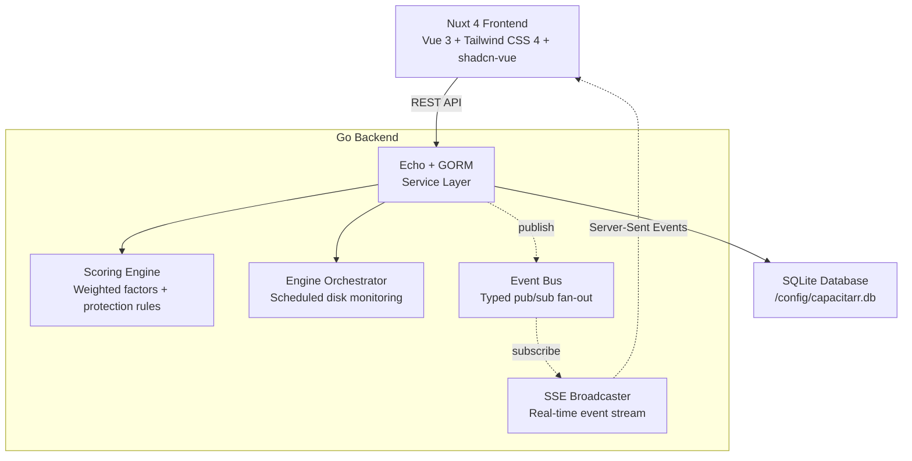
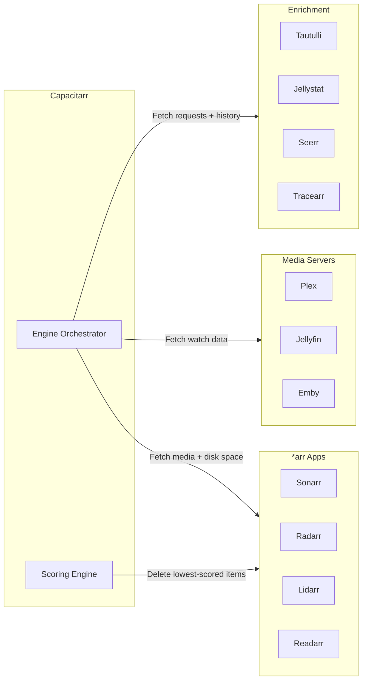
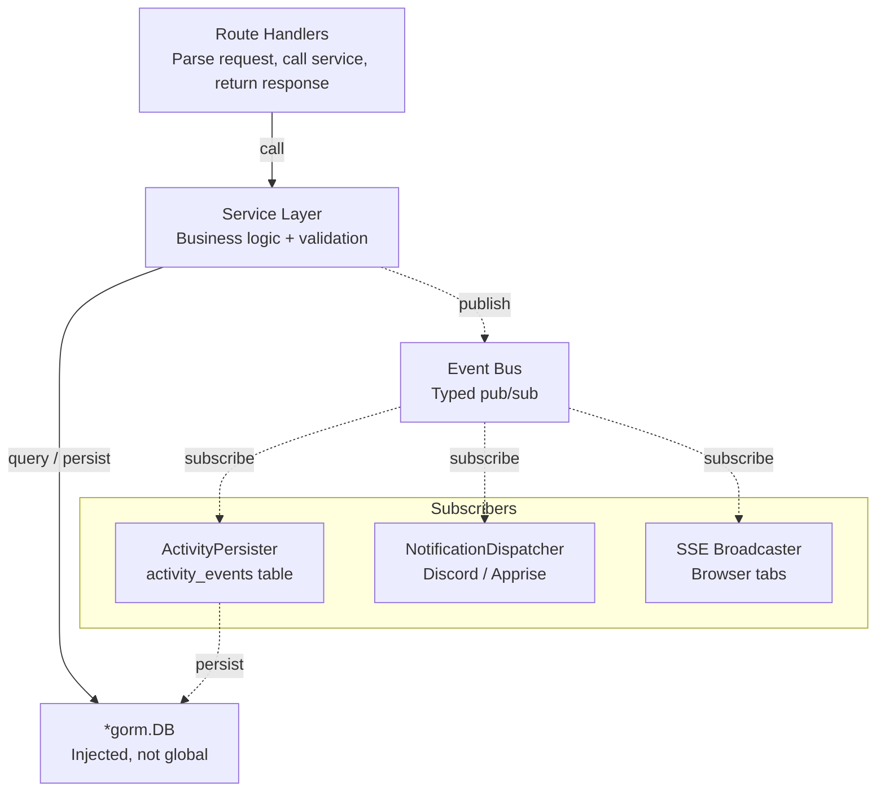
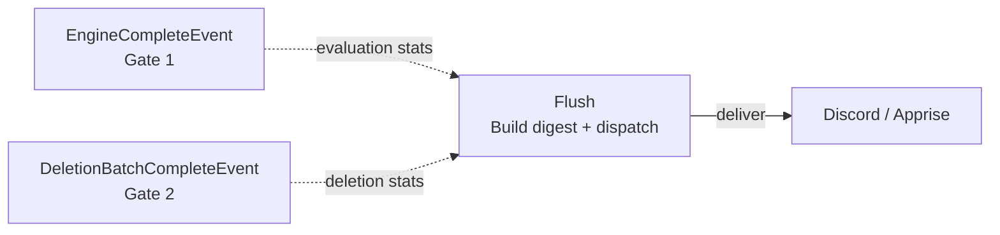
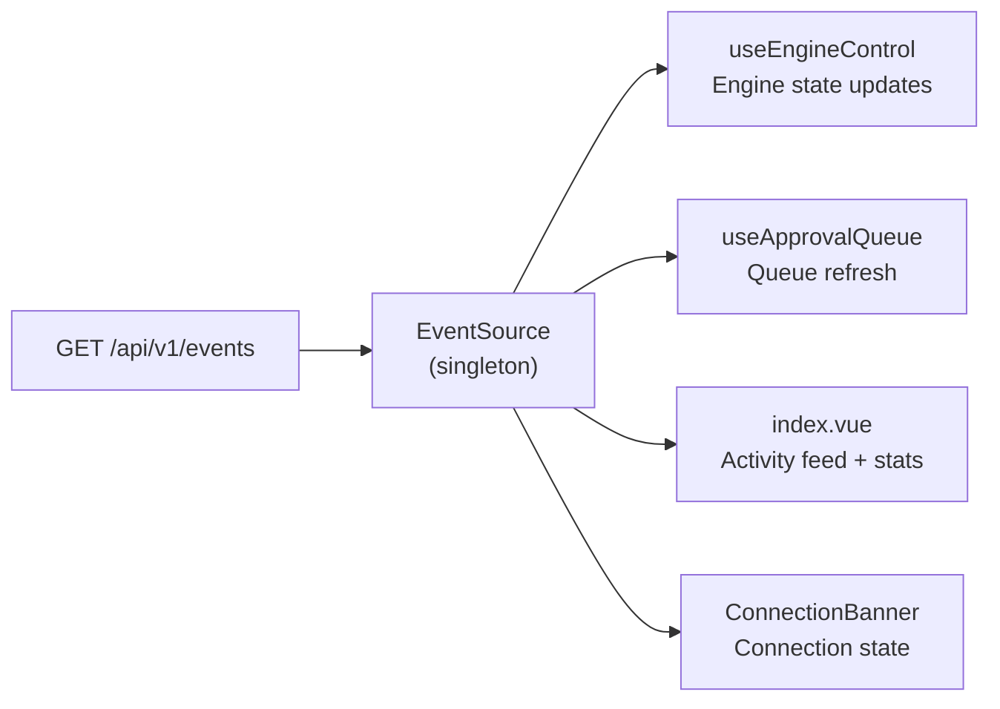

# Architecture

Capacitarr is a single-container application that bundles a Go backend, a Nuxt 4 (Vue 3) frontend, and a SQLite database. The frontend is statically generated at build time and embedded into the Go binary via `go:embed`, producing a single self-contained executable.

## High-Level Overview

### Container Internals

The Docker container runs a Go backend that serves the embedded Nuxt frontend. Communication flows through REST API calls and real-time Server-Sent Events.



### External Integrations

The engine orchestrator fetches data from external services, and the scoring engine sends deletion requests back to the *arr apps.



## Technology Stack

| Layer | Technology | Purpose |
|-------|-----------|---------|
| **Frontend** | Nuxt 4, Vue 3, Tailwind CSS 4, shadcn-vue, Lucide, ECharts | Dashboard UI, analytics visualizations, rule builder, score visualization, real-time updates via SSE |
| **Backend** | Go, Echo, GORM | REST API, authentication, integration clients, scheduling |
| **Service Layer** | Go (custom) | Business logic, event publishing, dependency injection |
| **Event System** | Go (custom) | Typed event bus, activity persistence, SSE broadcast, notification dispatch |
| **Database** | SQLite | Configuration, approval queue, audit log, engine statistics |
| **Container** | Alpine Linux, multi-stage Docker build | Minimal runtime image (~30 MB) |

## Backend Architecture

### Service Layer

All business logic lives in the service layer (`backend/internal/services/`). Route handlers are thin — they parse requests, call services, and return responses.



#### Service Registry

All services accept `*gorm.DB` and `*events.EventBus` in their constructor and are registered on `services.Registry`.

| Category | Service | Responsibilities |
|----------|---------|-----------------|
| **Core** | ApprovalService | Approve, reject, unsnooze queue items |
| | DeletionService | Execute deletions, dry run, handle failures |
| | DiskGroupService | Disk group CRUD, threshold management |
| | EngineService | Trigger runs, get stats |
| | SettingsService | Update preferences and thresholds |
| **Data** | AuditLogService | Create, upsert, dedup audit entries |
| | BackupService | Settings export/import and backup archive creation |
| | DatabaseBackupService | Automatic VACUUM INTO backup with rotation and retention |
| | DataService | Data reset operations |
| | MetricsService | History, rollup, lifetime stats |
| | RulesService | Custom rule CRUD, validation, and impact preview |
| | PreviewService | Scored media preview cache, SSE-driven invalidation |
| | MappingService | Media server TMDb ID → native ID mapping for cross-references |
| **Analytics** | WatchAnalyticsService | Dead content, stale content analytics |
| **Sunset** | SunsetService | Sunset queue CRUD, expiry processing, escalation, label management |
| | PosterOverlayService | Poster overlay lifecycle (apply, restore, update all) |
| **External** | IntegrationService | CRUD, test connections, sync data |
| | RecoveryService | Integration recovery with exponential backoff |
| | AuthService | Login, change password, generate API keys |
| | NotificationChannelService | CRUD for notification channels |
| | NotificationDispatchService | Two-gate flush, digest, and alerts |
| | VersionService | Update check via GitHub releases |
| | MigrationService | 1.x → 2.0 database migration |

### Service Registry

All services are instantiated in `main.go` and held in a `services.Registry` struct that is passed to route registration functions:

```go
type Registry struct {
    DB  *gorm.DB
    Bus *events.EventBus
    Cfg *config.Config

    Approval             *ApprovalService
    Backup               *BackupService
    Deletion             *DeletionService
    AuditLog             *AuditLogService
    DiskGroup            *DiskGroupService
    Engine               *EngineService
    Preview              *PreviewService
    Settings             *SettingsService
    Integration          *IntegrationService
    Auth                 *AuthService
    NotificationChannel  *NotificationChannelService
    NotificationDispatch *NotificationDispatchService
    Data                 *DataService
    Rules                *RulesService
    Metrics              *MetricsService
    Version              *VersionService
    WatchAnalytics       *WatchAnalyticsService
    Migration            *MigrationService
    Sunset               *SunsetService
    PosterOverlay        *PosterOverlayService
    Mapping              *MappingService
    Recovery             *RecoveryService
    DatabaseBackup       *DatabaseBackupService
}
```

Each service receives a `*gorm.DB` and `*events.EventBus` via constructor injection — no global state.

### Capability-Based Integration Interfaces

Integration clients implement only the capability interfaces they support, replacing a monolithic `Integration` interface:

| Interface | Description | Implementors |
|-----------|-------------|-------------|
| `Connectable` | Connection testing | All integrations |
| `MediaSource` | List managed media items | Sonarr, Radarr, Lidarr, Readarr |
| `DiskReporter` | Disk usage reporting | Sonarr, Radarr, Lidarr, Readarr |
| `MediaDeleter` | Delete media items | Sonarr, Radarr, Lidarr, Readarr |
| `WatchDataProvider` | Play counts and history | Plex, Jellyfin, Emby |
| `RequestProvider` | Media request data | Seerr |
| `WatchlistProvider` | User watchlists/favorites | Plex, Jellyfin, Emby |
| `CollectionDataProvider` | Collection memberships | Plex, Jellyfin, Emby |
| `CollectionResolver` | Resolve collection members for deletion | Radarr |
| `RuleValueFetcher` | Dynamic rule field values | Sonarr, Radarr, Lidarr, Readarr |
| `CollectionNameFetcher` | Fetch collection names for autocomplete | Plex, Jellyfin, Emby |
| `LabelDataProvider` | Label memberships for enrichment | Plex, Jellyfin, Emby |
| `LabelManager` | Apply and remove labels on media items | Plex, Jellyfin, Emby |
| `LabelNameFetcher` | Fetch label names for autocomplete | Plex, Jellyfin, Emby |
| `PosterManager` | Upload and restore poster images | Plex, Jellyfin, Emby |

### Integration Registry

The `IntegrationRegistry` provides runtime discovery of available integrations by capability:

```go
registry.WatchProviders()          // → [Plex, Jellyfin, Emby]
registry.MediaSources()            // → [Sonarr, Radarr, Lidarr, Readarr]
registry.DiskReporters()           // → [Sonarr, Radarr, Lidarr, Readarr]
registry.RequestProviders()        // → [Seerr]
registry.CollectionDataProviders() // → [Plex, Jellyfin, Emby]
registry.LabelDataProviders()      // → [Plex, Jellyfin, Emby]
registry.LabelManagers()           // → [Plex, Jellyfin, Emby]
registry.PosterManagers()          // → [Plex, Jellyfin, Emby]
```

Integration clients are created via a factory pattern (`integrations.CreateClient(config)`) and auto-registered. The poller and preview service use the registry to discover capabilities instead of hardcoded wiring.

### Enrichment Pipeline

Media items pass through a composable enrichment pipeline after fetching:

```mermaid
flowchart LR
    FETCH["Fetch<br/>MediaSource.GetMediaItems()"]

    subgraph WATCH_DATA["Watch Data Enrichers"]
        direction LR
        BULK["BulkWatchEnricher<br/>Play counts + last played"]
        TAUTULLI_E["TautulliEnricher<br/>Per-user watch data"]
        JELLYSTAT_E["JellystatEnricher<br/>Per-user watch data"]
        TRACEARR_E["TracearrEnricher<br/>Unified watch data"]

        BULK --> TAUTULLI_E --> JELLYSTAT_E --> TRACEARR_E
    end

    subgraph METADATA["Metadata Enrichers"]
        direction LR
        REQUEST["RequestEnricher<br/>Seerr request status"]
        WATCHLIST["WatchlistEnricher<br/>Watchlist/favorites"]
        COLLECTION["CollectionEnricher<br/>Collection memberships"]
        LABEL["LabelEnricher<br/>Media server labels"]

        REQUEST --> WATCHLIST --> COLLECTION --> LABEL
    end

    subgraph XREF_GROUP["Cross-Reference"]
        XREF["CrossReferenceEnricher<br/>Requestor watched?"]
    end

    FETCH --> BULK
    TRACEARR_E --> REQUEST
    LABEL --> XREF
```



Each enricher implements the `Enricher` interface (`Name()`, `Priority()`, `Enrich(items)`) and is auto-discovered from the registry's capabilities. The pipeline currently includes 9 enrichers.

### Pluggable Scoring Factors

The scoring engine uses a `ScoringFactor` interface for each scoring dimension:

| Factor | Weight Key | Description |
|--------|-----------|-------------|
| `WatchHistoryFactor` | `watch_history` | Play count influence |
| `RecencyFactor` | `last_watched` | Recency of last watch |
| `FileSizeFactor` | `file_size` | Larger files scored higher for deletion |
| `RatingFactor` | `rating` | Community/critic ratings |
| `LibraryAgeFactor` | `time_in_library` | Older items scored higher |
| `SeriesStatusFactor` | `series_status` | Ended series scored higher |
| `RequestPopularityFactor` | `request_popularity` | Requested content is protected |

New factors can be added by implementing the `ScoringFactor` interface and registering them — no changes to the evaluator loop.

### Event Bus

The event bus uses a fan-out pattern with one goroutine per subscriber and buffered channels.

```go
// Event is the interface all typed events implement.
type Event interface {
    EventType() string
    EventMessage() string
}

type EventBus struct {
    mu          sync.RWMutex
    subscribers map[chan Event]struct{}
    closed      bool
}

func (b *EventBus) Publish(event Event)
func (b *EventBus) Subscribe() chan Event
func (b *EventBus) Unsubscribe(ch chan Event)
func (b *EventBus) Close()
```

When a service performs an action (e.g., approving an item, completing an engine run), it publishes a typed event to the bus. Three subscribers react to every event:

1. **ActivityPersister** — writes the event to the `activity_events` table for the dashboard feed
2. **NotificationDispatcher** — filters events against notification channel subscriptions and delivers to Discord/Apprise
3. **SSEBroadcaster** — serializes the event as an SSE message and pushes it to all connected browser tabs

### Notification Dispatch

The `NotificationDispatchService` uses a **two-gate flush pattern** to ensure cycle digest notifications contain complete data from both the evaluation phase and the deletion phase of an engine run.



**Cycle digests** are batched summaries sent once per engine run. They include evaluated count, flagged count, deleted count, freed bytes, duration, and disk usage. The digest is only dispatched after both gates fire, ensuring deletion results are included.

**Instant alerts** fire immediately when their trigger event occurs — they are not batched. Alert types include engine errors, mode changes, server started, threshold breaches, update available, approval activity, and integration status (failure + recovery).

See [notifications.md](../guides/notifications.md) for the full user-facing guide.

### Event Types

| Category | Events |
|----------|--------|
| **Engine** | `engine_start`, `engine_complete`, `engine_error`, `manual_run_triggered`, `enrichment_complete` |
| **Settings** | `engine_mode_changed`, `settings_changed`, `threshold_changed`, `threshold_breached`, `settings_exported`, `settings_imported` |
| **Auth** | `login`, `password_changed`, `username_changed`, `api_key_generated` |
| **Integration** | `integration_added`, `integration_updated`, `integration_removed`, `integration_test`, `integration_test_failed`, `integration_recovered`, `integration_recovery_attempt` |
| **Approval** | `approval_approved`, `approval_rejected`, `approval_unsnoozed`, `approval_bulk_unsnoozed`, `approval_orphans_recovered`, `approval_queue_cleared`, `approval_dismissed`, `approval_queue_reconciled`, `approval_returned_to_pending` |
| **Deletion** | `deletion_success`, `deletion_failed`, `deletion_dry_run`, `deletion_batch_complete`, `deletion_progress`, `deletion_queued`, `deletion_cancelled`, `deletion_grace_period` |
| **Rules** | `rule_created`, `rule_updated`, `rule_deleted` |
| **Notifications** | `notification_channel_added`, `notification_channel_updated`, `notification_channel_removed`, `notification_sent`, `notification_delivery_failed` |
| **Sunset** | `sunset_created`, `sunset_cancelled`, `sunset_expired`, `sunset_rescheduled`, `sunset_escalated`, `sunset_misconfigured`, `sunset_saved`, `sunset_saved_cleaned`, `sunset_label_applied`, `sunset_label_removed`, `sunset_label_failed` |
| **Poster Overlay** | `poster_overlay_applied`, `poster_overlay_restored`, `poster_overlay_failed` |
| **Preview** | `preview_updated`, `preview_invalidated`, `analytics_updated` |
| **Data** | `data_reset` |
| **System** | `server_started`, `update_available`, `version_check` |

### SSE (Server-Sent Events)

The frontend connects to `GET /api/v1/events` (authenticated, long-lived HTTP connection) to receive real-time updates. This replaces the previous polling-based approach.

```
HTTP/1.1 200 OK
Content-Type: text/event-stream
Cache-Control: no-cache
Connection: keep-alive

id: 1
event: engine_start
data: {"message":"Engine run started in approval mode","executionMode":"approval"}

id: 2
event: engine_complete
data: {"message":"Engine run completed: evaluated 97, flagged 12","evaluated":97,"flagged":12}
```

Key features:
- Auto-increment event IDs for replay support via `Last-Event-ID` header
- In-memory ring buffer (last 100 events) for reconnection replay
- Keepalive comments every 30 seconds to prevent proxy timeouts
- Auto-reconnect with exponential backoff on the client side

## Database Schema

The database uses two purpose-specific tables instead of a single overloaded table:

### Approval Queue

Active approval queue items with a state machine (`pending` → `approved`/`rejected`):

| Column | Type | Description |
|--------|------|-------------|
| `id` | INTEGER | Primary key |
| `media_name` | TEXT | Item title |
| `media_type` | TEXT | `movie`, `show`, `season`, `episode`, `artist`, `book` |
| `reason` | TEXT | Score explanation |
| `score_details` | TEXT | JSON-encoded score breakdown |
| `size_bytes` | INTEGER | File size |
| `integration_id` | INTEGER | FK to `integration_configs` (required) |
| `external_id` | TEXT | External ID in the integration |
| `status` | TEXT | `pending`, `approved`, `rejected` |
| `snoozed_until` | DATETIME | When snooze expires (rejected items) |
| `created_at` | DATETIME | Row creation |
| `updated_at` | DATETIME | Last state transition |

### Audit Log

Permanent, append-only history of deletions and dry-runs:

| Column | Type | Description |
|--------|------|-------------|
| `id` | INTEGER | Primary key |
| `media_name` | TEXT | Item title |
| `media_type` | TEXT | Media type |
| `reason` | TEXT | Score explanation |
| `score_details` | TEXT | JSON-encoded score breakdown |
| `action` | TEXT | `deleted`, `dry_run`, `dry_delete` |
| `size_bytes` | INTEGER | File size |
| `integration_id` | INTEGER | FK to `integration_configs` (nullable — preserved on integration delete) |
| `created_at` | DATETIME | Row creation |

### Activity Events

Transient dashboard feed with 7-day retention:

| Column | Type | Description |
|--------|------|-------------|
| `id` | INTEGER | Primary key |
| `event_type` | TEXT | Event type identifier |
| `message` | TEXT | Human-readable message |
| `metadata` | TEXT | Optional JSON payload |
| `created_at` | DATETIME | Row creation |

## Frontend Architecture

### SSE Integration

The frontend uses a singleton `useEventStream` composable that maintains a single `EventSource` connection shared across all components:



- `app.vue` initializes the SSE connection on mount when authenticated
- Components subscribe to specific event types and react accordingly
- Engine state, approval queue, and activity feed update in real-time without polling
- `ConnectionBanner.vue` uses SSE connection state as the primary health indicator

### Page Structure

| Page | Route | Purpose |
|------|-------|---------|
| Dashboard | `/` | Disk groups, approval queue, activity feed, engine controls, sparklines |
| Library | `/library` | Browse (smart filters, virtual scrolling) + History (audit log) — 2 tabs |
| Audit | `/audit` | Full deletion and dry-run history |
| Rules | `/rules` | Cascading rule builder, drag-and-drop sort, rule impact badges |
| Settings | `/settings` | Preferences, integrations, notifications, auth |
| Help | `/help` | Scoring guide, FAQ, about section |
| Login | `/login` | Authentication |
| Migrate | `/migrate` | Optional 1.x → 2.0 database migration stepper |

## Project Structure

```
capacitarr/
├── backend/                        # Go backend
│   ├── main.go                     # Application entrypoint, wiring
│   ├── internal/
│   │   ├── config/                 # Environment variable loading
│   │   ├── cache/                  # Generic TTL cache
│   │   ├── db/                     # SQLite models, schema migrations
│   │   ├── engine/                 # Scoring + rule evaluation
│   │   ├── events/                 # Event bus, typed events, SSE broadcaster, activity persister
│   │   ├── integrations/           # *arr, Plex, Jellyfin, Emby, Seerr, Tautulli, Jellystat, Tracearr clients + registry + enrichment pipeline
│   │   ├── jobs/                   # Cron scheduling (retention cleanup, time-series rollups)
│   │   ├── notifications/          # Discord, Apprise notification senders + HTTP client
│   │   ├── poller/                 # Engine orchestrator (scheduled disk monitoring)
│   │   ├── migration/              # 1.x → 2.0 database migration detection + import
│   │   ├── services/               # Service layer (business logic)
│   │   ├── testutil/               # Shared test helpers (in-memory DB, fixtures)
│   │   └── logger/                 # Structured logging
│   └── routes/                     # REST API handlers + middleware
├── frontend/                       # Nuxt 4 frontend
│   ├── app/
│   │   ├── components/             # Vue components (shadcn-vue based)
│   │   ├── composables/            # Vue composables (useEventStream, useEngineControl, etc.)
│   │   ├── pages/                  # Nuxt pages (dashboard, library, audit, rules, settings, help, login, migrate)
│   │   ├── locales/                # i18n translations (22 languages)
│   │   ├── types/                  # TypeScript type definitions
│   │   └── assets/css/             # Tailwind CSS + theme variables
│   └── nuxt.config.ts              # Nuxt configuration
├── site/                           # Project marketing site (Nuxt UI Pro)
├── docs/                           # Documentation
│   └── reference/api/              # OpenAPI spec, examples, workflows
├── scripts/                        # Release utility scripts (Discord notify, Docker build/mirror)
├── Dockerfile                      # Multi-stage build (Node → Go → Alpine)
└── Makefile                        # CI/CD targets (lint, test, security, build)
```
